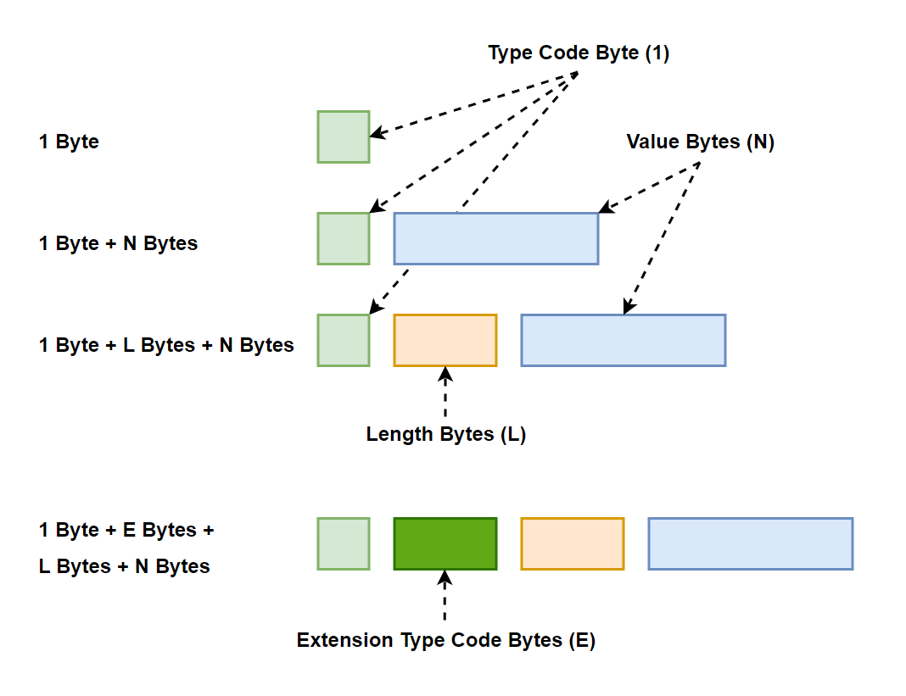

# Polymorph Data Encoding (PDE) Specification

Polymorph Data Encoding (PDE) is a binary data encoding that is versatile, flexible, compact and fast to read and write.
Polymorph Data Encoding is an alternative to MessagePack, CBOR, Protobuf, ION, Avro and other binary data formats.

See more about the purpose of PDE, and how PDE compares to other data formats, in the README file here:

[README.md](README.md)

## PDE Tutorial
The PDE encoding is explained in a more tutorial-like style (link below). In case of differences between
the tutorial and this specification - trust this specification - not the tutorial! . Any discrepancies will
be fixed as fast as possible.

[https://jenkov.com/tutorials/polymorph-data/polymorph-data-encoding.html](https://jenkov.com/tutorials/polymorph-data/polymorph-data-encoding.html)

## PDE Files Are Streams of PDE Fields

A PDE file (or stream) consists of a stream (sequence) of PDE fields. This is different from XML and JSON which
consists of a single "document" (a single root XML element, or a single root JSON array or object). 

A PDE field contains a data value of a certain data type (field type).

Each field within a PDE file (or stream) is considered to have an offset. The offset represents the offset 
of that field from the beginning of the file (or stream). The first PDE field has the offset 0.
The next PDE field has the offset 1 etc. 

Only root level PDE fields have an offset. PDE fields nested within another PDE field are not considered
to have stream level offsets.

The offsets are not explicitly visible in the PDE file (or stream). They are implicit - and based on
the offsets of the fields that preceded it in the file (or stream).

It is possible to have offset gaps in a PDE stream. For instance, if a PDE stream represented a
change log for a system, and you decide to create a snapshot of that stream - the resulting snapshot
PDE field stream (or file) might have less PDE fields than the original - because some of the 
fields from the original stream are now represented by a single field containing all the changes
made to the abstract entity referenced by the replaced PDE fields.

Offset gaps will be modeled using metadata fields - just like sub-stream IDs.

PDE field offsets enable you to PDE field streams as a means of subscribing to changes
either from the beginning of a PDE field stream (offset 0), or from the last offset you have already
received (e.g. offset 4785).  

Similarly, you could to partial / incremental processing of a PDE file. If you have already processed
up to offset N of a PDE file, you can continue from offset N+1 the next time you open the file.

PDE field offsets also enable easy incremental replication of PDE files and streams between computers.

Here is an abstract example of a PDE field stream:

    field     # field with offset 0 
    field     # field with offset 1 
    field     # field with offset 2

    metadata field - offset 10   # metadata field that represents a gap in offsets from 3 to and including 9.
    field     # field with offset 10 
    field     # field with offset 11 
    field     # field with offset 12

In case a PDE field stream contains sub-streams - the offsets of each PDE field should be interpreted 
as being an offset within each sub-stream - not within the main multi-sub-stream stream. In other words,
sub-streams have their own individual offsets. 

Similarly, offset gaps within a sub-stream only count for that sub-stream - not for other sub-streams
within the same multi-sub-stream stream.

    # metadata field that represents beginning of substream 1
    metadata field - sub-stream 1   
    field     # field with offset 0 
    field     # field with offset 1 
    field     # field with offset 2

    # metadata field that represents beginning of substream 2
    metadata field - sub-stream 2    
    field     # field with offset 0 
    field     # field with offset 1 
    field     # field with offset 2

    # metadata field that represents a gap in offsets from 3 to and including 9 - within sub-stream 2 only 
    metadata field - offset 10   
    field     # field with offset 10 
    field     # field with offset 11 
    field     # field with offset 12

## PDE Fields Are Either Atomic or Composite
PDE fields can either be atomic or composite. 

 - An atomic field only contains a single raw data value. 
 - A composite field contains other PDE fields nested inside it. A composite field has no raw value of its own - only the nested PDE fields.

A boolean PDE field is an example of an atomic field. It only contains a single null, true or false value.

An object PDE field is an example of a composite field. An object field can have other PDE fields nested inside it.

## PDE Field Encodings 
Each PDE field are encoded in bytes using a field type, length and value. The type, length and value can all be read f
rom the bytes in the PDE byte stream. No schema is needed.

PDE fields can use one of the following different encoding schemes:

1) 1 byte
2) 1 + N bytes
3) 1 + L + N bytes
4) 1 + (1 to 8) + [L] + N bytes

What these encodings mean, is explained in the following list:

1) 1 field type byte that also implicitly tells its value (1 byte in total).
2) 1 field type byte + N value bytes (1 + N bytes total).
3) 1 field type byte + L length bytes + N value bytes (1 + L + N bytes in total).
4) 1 extension field type byte + 1 to 8 field type bytes + whatever bytes are required for that extended field encoding.

A PDE field always has a single byte (the type code) that tells the field type.  

Depending on the value of the field type byte (its numerical value) you can deduct some information about the 
length of the value of that field. Sometimes the value is implicit in the field type, so the field has no
explicit value bytes. Sometimes the field type indicates the exact number of bytes of the value (its length).
And sometimes the field type indicates a number of length bytes following the type byte, which contain the
number of bytes of the value (its length). The only way to find it is to look at the numerical value of
the field type byte, and consult this specification to see how that field type is encoded.

(Extension field encodings are a bit special. They are a way for you to add your own custom PDE fields to the stream of PDE fields.
To make PDE field streams parseable without a schema, extension field encodings must follow some set of predetermined encoding
schemes - which I have not yet 100% decided on. I will get back and finish the design of extension field encodings 
when I have analyzed it in more detail.)

This diagram sums up the PDE encoding variations:

Here are some PDE encoding examples in hexadecimal representation, showing

- A PDE field consisting of only 1 byte (the field type code byte)
- A PDE field consisting of 1 byte (the field type code byte) and some value bytes
- A PDE field consisting of 1 byte (the field type code byte), some length bytes and some value bytes

Remember, all integers, floats etc. are encoded using little endian encoding, meaning the least significant byte of the number is the first byte in the sequence.

    # PDE fields that consists of only 1 byte
    00            # A boolean null field
    01            # A boolean true field
    02            # A boolean false field

    # PDE fields that consists of 1 type code byte and N value bytes
    04   A3       # A positive integer field with a 1 byte value
    05   A3 0E    # A positive integer field with a 2 byte value - little endian encoded ( => 0EA3 => 3747 in decimal)

    # PDE field that consists of 
    29   00 01   XX XX XX XX ...    # A bytes field with 2 length bytes (0 and 1 in little endian 
                                    # => 0100 as hex number => 256 in decimal) and the XX'es 
                                    # represents the value bytes (there should be 256 in total 
                                    # - because that is what the length bytes say - but this example
                                    # only shows 4 value bytes).
    

## PDE Field Type Codes 
The first byte of a PDE field is the PDE field's type code. The available PDE field type codes are listed in the table below. 

| Type Code   | Field Name              | Field Description                                                                                                                          |
|-------------|-------------------------|--------------------------------------------------------------------------------------------------------------------------------------------|
| 0           | BOOLEAN_NULL            | A single byte with the value 0 - representing a boolean field with a null value.                                                           |
| 1           | BOOLEAN_TRUE            | A single byte with the value 1 - representing a boolean field with the value true.                                                         |
| 2           | BOOLEAN_FALSE           | A single byte with the value 2 - representing a boolean field with the value false.                                                        |
| 3           | INT_NULL                | A single byte representing an Integer field with the value null.                                                                           | 
| 4           | INT_POS_1_BYTES         | An positive integer field which value is 1 byte long.                                                                                      |
| 5           | INT_POS_2_BYTES         | An positive integer field which value is 2 bytes long.                                                                                     |
| 6           | INT_POS_3_BYTES         | An positive integer field which value is 3 bytes long.                                                                                     |
| 7           | INT_POS_4_BYTES         | An positive integer field which value is 4 bytes long.                                                                                     |
| 8           | INT_POS_5_BYTES         | An positive integer field which value is 5 bytes long.                                                                                     |
| 9           | INT_POS_6_BYTES         | An positive integer field which value is 6 bytes long.                                                                                     |
| 10          | INT_POS_7_BYTES         | An positive integer field which value is 7 bytes long.                                                                                     |
| 11          | INT_POS_8_BYTES         | An positive integer field which value is 8 bytes long.                                                                                     |
| 12          | INT_NEG_1_BYTES         | An negative integer field which value is 1 byte long.                                                                                      |
| 13          | INT_NEG_2_BYTES         | An negative integer field which value is 2 bytes long.                                                                                     |
| 14          | INT_NEG_3_BYTES         | An negative integer field which value is 3 bytes long.                                                                                     |
| 15          | INT_NEG_4_BYTES         | An negative integer field which value is 4 bytes long.                                                                                     |
| 16          | INT_NEG_5_BYTES         | An negative integer field which value is 5 bytes long.                                                                                     |
| 17          | INT_NEG_6_BYTES         | An negative integer field which value is 6 bytes long.                                                                                     |
| 18          | INT_NEG_7_BYTES         | An negative integer field which value is 7 bytes long.                                                                                     |
| 19          | INT_NEG_8_BYTES         | An negative integer field which value is 8 bytes long.                                                                                     |
| 20          | FLOAT_NULL              | A 1 byte long field representing a float field with a null value.                                                                          |
| 21          | FLOAT_4_BYTES           | A float field which value is 4 bytes long (32 bit float).                                                                                  |
| 22          | FLOAT_8_BYTES           | A float field which value is 8 bytes long (64 bit float).                                                                                  |
| 23          | BYTES_NULL              | A single byte field representing a Bytes field with the value null.                                                                        |
| 24          | BYTES_0_BYTES           | A single byte field representing a Bytes field with a length of 0 bytes (empty).                                                           |
| 25          | BYTES_1_BYTES           | A bytes field with a value that is 1 byte long.                                                                                            |
| 26          | BYTES_2_BYTES           | A bytes field with a value that is 2 bytes long.                                                                                           |
| 27          | BYTES_3_BYTES           | A bytes field with a value that is 3 bytes long.                                                                                           |
| 28          | BYTES_4_BYTES           | A bytes field with a value that is 4 bytes long.                                                                                           |
| 29          | BYTES_5_BYTES           | A bytes field with a value that is 5 bytes long.                                                                                           |
| 30          | BYTES_6_BYTES           | A bytes field with a value that is 6 bytes long.                                                                                           |
| 31          | BYTES_7_BYTES           | A bytes field with a value that is 7 bytes long.                                                                                           |
| 32          | BYTES_8_BYTES           | A bytes field with a value that is 8 bytes long.                                                                                           |
| 33          | BYTES_9_BYTES           | A bytes field with a value that is 9 bytes long.                                                                                           |
| 34          | BYTES_10_BYTES          | A bytes field with a value that is 10 bytes long.                                                                                          |
| 35          | BYTES_11BYTES           | A bytes field with a value that is 11 bytes long.                                                                                          |
| 36          | BYTES_12_BYTES          | A bytes field with a value that is 12 bytes long.                                                                                          |
| 37          | BYTES_13_BYTES          | A bytes field with a value that is 13 bytes long.                                                                                          |
| 38          | BYTES_14_BYTES          | A bytes field with a value that is 14 bytes long.                                                                                          |
| 39          | BYTES_15_BYTES          | A bytes field with a value that is 15 bytes long.                                                                                          |
| 40          | BYTES_1_LENGTH_BYTES    | A bytes field that uses 1 length byte to represent the length of the field value.                                                          |
| 41          | BYTES_2_LENGTH_BYTES    | A bytes field that uses 2 length byte to represent the length of the field value.                                                          |
| 42          | BYTES_3_LENGTH_BYTES    | A bytes field that uses 3 length byte to represent the length of the field value.                                                          |
| 43          | BYTES_4_LENGTH_BYTES    | A bytes field that uses 4 length byte to represent the length of the field value.                                                          |
| 44          | BYTES_5_LENGTH_BYTES    | A bytes field that uses 5 length byte to represent the length of the field value.                                                          |
| 45          | BYTES_6_LENGTH_BYTES    | A bytes field that uses 6 length byte to represent the length of the field value.                                                          |
| 46          | BYTES_7_LENGTH_BYTES    | A bytes field that uses 7 length byte to represent the length of the field value.                                                          |
| 47          | BYTES_8_LENGTH_BYTES    | A bytes field that uses 8 length byte to represent the length of the field value.                                                          |
| 48          | ASCII_NULL              | A single byte field representing an ASCII field with the value null.                                                                       |
| 49          | ASCII_0_BYTES           | A single byte field representing an ASCII field with a length of 0 bytes (empty).                                                          |
| 50          | ASCII_1_BYTES           | An ASCII field with a value that is 1 byte long.                                                                                           |
| 51          | ASCII_2_BYTES           | An ASCII field with a value that is 2 bytes long.                                                                                          |
| 52          | ASCII_3_BYTES           | An ASCII field with a value that is 3 bytes long.                                                                                          |
| 53          | ASCII_4_BYTES           | An ASCII field with a value that is 4 bytes long.                                                                                          |
| 54          | ASCII_5_BYTES           | An ASCII field with a value that is 5 bytes long.                                                                                          |
| 55          | ASCII_6_BYTES           | An ASCII field with a value that is 6 bytes long.                                                                                          |
| 56          | ASCII_7_BYTES           | An ASCII field with a value that is 7 bytes long.                                                                                          |
| 57          | ASCII_8_BYTES           | An ASCII field with a value that is 8 bytes long.                                                                                          |
| 58          | ASCII_9_BYTES           | An ASCII field with a value that is 9 bytes long.                                                                                          |
| 59          | ASCII_10_BYTES          | An ASCII field with a value that is 10 bytes long.                                                                                         |
| 60          | ASCII_11BYTES           | An ASCII field with a value that is 11 bytes long.                                                                                         |
| 61          | ASCII_12_BYTES          | An ASCII field with a value that is 12 bytes long.                                                                                         |
| 62          | ASCII_13_BYTES          | An ASCII field with a value that is 13 bytes long.                                                                                         |
| 63          | ASCII_14_BYTES          | An ASCII field with a value that is 14 bytes long.                                                                                         |
| 64          | ASCII_15_BYTES          | An ASCII field with a value that is 15 bytes long.                                                                                         |
| 65          | ASCII_1_LENGTH_BYTES    | An ASCII field that uses 1 length byte to represent the length of the field value.                                                         |
| 66          | ASCII_2_LENGTH_BYTES    | An ASCII field that uses 2 length byte to represent the length of the field value.                                                         |
| 67          | ASCII_3_LENGTH_BYTES    | An ASCII field that uses 3 length byte to represent the length of the field value.                                                         |
| 68          | ASCII_4_LENGTH_BYTES    | An ASCII field that uses 4 length byte to represent the length of the field value.                                                         |
| 69          | ASCII_5_LENGTH_BYTES    | An ASCII field that uses 5 length byte to represent the length of the field value.                                                         |
| 70          | ASCII_6_LENGTH_BYTES    | An ASCII field that uses 6 length byte to represent the length of the field value.                                                         |
| 71          | ASCII_7_LENGTH_BYTES    | An ASCII field that uses 7 length byte to represent the length of the field value.                                                         |
| 72          | ASCII_8_LENGTH_BYTES    | An ASCII field that uses 8 length byte to represent the length of the field value.                                                         |
| 73          | UTF_8_NULL              | A single UTF-8 field representing a Bytes field with the value null.                                                                       |
| 74          | UTF_8_0_BYTES           | A single UTF-8 field representing a Bytes field with a length of 0 bytes (empty).                                                          |
| 75          | UTF_8_1_BYTES           | A UTF-8 field with a value that is 1 byte long.                                                                                            |
| 76          | UTF_8_2_BYTES           | A UTF-8 field with a value that is 2 bytes long.                                                                                           |
| 77          | UTF_8_3_BYTES           | A UTF-8 field with a value that is 3 bytes long.                                                                                           |
| 78          | UTF_8_4_BYTES           | A UTF-8 field with a value that is 4 bytes long.                                                                                           |
| 79          | UTF_8_5_BYTES           | A UTF-8 field with a value that is 5 bytes long.                                                                                           |
| 80          | UTF_8_6_BYTES           | A UTF-8 field with a value that is 6 bytes long.                                                                                           |
| 81          | UTF_8_7_BYTES           | A UTF-8 field with a value that is 7 bytes long.                                                                                           |
| 82          | UTF_8_8_BYTES           | A UTF-8 field with a value that is 8 bytes long.                                                                                           |
| 83          | UTF_8_9_BYTES           | A UTF-8 field with a value that is 9 bytes long.                                                                                           |
| 84          | UTF_8_10_BYTES          | A UTF-8 field with a value that is 10 bytes long.                                                                                          |
| 85          | UTF_8_11_BYTES          | A UTF-8 field with a value that is 11 bytes long.                                                                                          |
| 86          | UTF_8_12_BYTES          | A UTF-8 field with a value that is 12 bytes long.                                                                                          |
| 87          | UTF_8_13_BYTES          | A UTF-8 field with a value that is 13 bytes long.                                                                                          |
| 88          | UTF_8_14_BYTES          | A UTF-8 field with a value that is 14 bytes long.                                                                                          |
| 89          | UTF_8_15_BYTES          | A UTF-8 field with a value that is 15 bytes long.                                                                                          |
| 90          | UTF_8_1_LENGTH_BYTES    | A UTF-8 field that uses 1 length byte to represent the length of the field value.                                                          |
| 91          | UTF_8_2_LENGTH_BYTES    | A UTF-8 field that uses 2 length byte to represent the length of the field value.                                                          |
| 92          | UTF_8_3_LENGTH_BYTES    | A UTF-8 field that uses 3 length byte to represent the length of the field value.                                                          |
| 93          | UTF_8_4_LENGTH_BYTES    | A UTF-8 field that uses 4 length byte to represent the length of the field value.                                                          |
| 94          | UTF_8_5_LENGTH_BYTES    | A UTF-8 field that uses 5 length byte to represent the length of the field value.                                                          |
| 95          | UTF_8_6_LENGTH_BYTES    | A UTF-8 field that uses 6 length byte to represent the length of the field value.                                                          |
| 96          | UTF_8_7_LENGTH_BYTES    | A UTF-8 field that uses 7 length byte to represent the length of the field value.                                                          |
| 97          | UTF_8_8_LENGTH_BYTES    | A UTF-8 field that uses 8 length byte to represent the length of the field value.                                                          |
| 98          | UTC_NULL                | A UTC field with a null value.                                                                                                             |
| 99          | UTC_2_BYTES             | A UTC field with only a year specified - in its 2 bytes.                                                                                   |
| 100         | UTC_3_BYTES             | A UTC field with a year and month specified - in its 3 bytes.                                                                              |
| 101         | UTC_4_BYTES             | A UTC field with a year, month and day specified - in its 4 bytes.                                                                         |
| 102         | UTC_5_BYTES             | A UTC field with a year, month, day and hour specified - in its 5 bytes.                                                                   |
| 103         | UTC_6_BYTES             | A UTC field with a year, month, day, hour and minutes specified - in its 6 bytes.                                                          |
| 104         | UTC_7_BYTES             | A UTC field with a year, month, day, hour, minute and seconds specified - in its 7 bytes.                                                  |
| 105         | UTC_8_BYTES             | A UTC field with a UTC timestamp in milliseconds in its 8 bytes.                                                                           |
| 106         | UTC_9_BYTES             | A UTC field with a year, month, day, hour, minutes, seconds + milliseconds specified - in its 9 bytes.                                     |
| 107         | UTC_10_BYTES            | A UTC field with a year, month, day, hour, minutes, seconds + nanoseconds specified - in its 10 bytes.                                     |
| 108         | COPY_1_BYTES            | A copy of another field found a relative number of bytes earlier in this PDE stream - using 1 byte to represent the relative offset.       |
| 109         | COPY_2_BYTES            | A copy of another field found a relative number of bytes earlier in this PDE stream - using 2 bytes to represent the relative offset.      |
| 110         | COPY_3_BYTES            | A copy of another field found a relative number of bytes earlier in this PDE stream - using 3 bytes to represent the relative offset.      |
| 111         | COPY_4_BYTES            | A copy of another field found a relative number of bytes earlier in this PDE stream - using 4 bytes to represent the relative offset.      |
| 112         | COPY_5_BYTES            | A copy of another field found a relative number of bytes earlier in this PDE stream - using 5 bytes to represent the relative offset.      |
| 113         | COPY_6_BYTES            | A copy of another field found a relative number of bytes earlier in this PDE stream - using 6 bytes to represent the relative offset.      |
| 114         | COPY_7_BYTES            | A copy of another field found a relative number of bytes earlier in this PDE stream - using 7 bytes to represent the relative offset.      |
| 115         | COPY_8_BYTES            | A copy of another field found a relative number of bytes earlier in this PDE stream - using 8 bytes to represent the relative offset.      |
| 116         | REFERENCE_1_BYTES       | A reference to another field found a relative number of bytes earlier in this PDE stream - using 1 byte to represent the relative offset.  |
| 117         | REFERENCE_2_BYTES       | A reference to another field found a relative number of bytes earlier in this PDE stream - using 2 bytes to represent the relative offset. |
| 118         | REFERENCE_3_BYTES       | A reference to another field found a relative number of bytes earlier in this PDE stream - using 3 bytes to represent the relative offset. |
| 119         | REFERENCE_4_BYTES       | A reference to another field found a relative number of bytes earlier in this PDE stream - using 4 bytes to represent the relative offset. |
| 120         | REFERENCE_5_BYTES       | A reference to another field found a relative number of bytes earlier in this PDE stream - using 5 bytes to represent the relative offset. |
| 121         | REFERENCE_6_BYTES       | A reference to another field found a relative number of bytes earlier in this PDE stream - using 6 bytes to represent the relative offset. |
| 122         | REFERENCE_7_BYTES       | A reference to another field found a relative number of bytes earlier in this PDE stream - using 7 bytes to represent the relative offset. |
| 123         | REFERENCE_8_BYTES       | A reference to another field found a relative number of bytes earlier in this PDE stream - using 8 bytes to represent the relative offset. |
| 124         | KEY_NULL                | A key field with a null value.                                                                                                             |
| 125         | KEY_0_BYTES             | A key field with an empty value.                                                                                                           |
| 126         | KEY_1_BYTES             | A key field with a 1 byte value.                                                                                                           |
| 127         | KEY_2_BYTES             | A key field with a 2 byte value.                                                                                                           |
| 128         | KEY_3_BYTES             | A key field with a 3 byte value.                                                                                                           |
| 129         | KEY_4_BYTES             | A key field with a 4 byte value.                                                                                                           |
| 130         | KEY_5_BYTES             | A key field with a 5 byte value.                                                                                                           |
| 131         | KEY_6_BYTES             | A key field with a 6 byte value.                                                                                                           |
| 132         | KEY_7_BYTES             | A key field with a 7 byte value.                                                                                                           |
| 133         | KEY_8_BYTES             | A key field with a 8 byte value.                                                                                                           |
| 134         | KEY_9_BYTES             | A key field with a 9 byte value.                                                                                                           |
| 135         | KEY_10_BYTES            | A key field with a 10 byte value.                                                                                                          |
| 136         | KEY_11_BYTES            | A key field with a 11 byte value.                                                                                                          |
| 137         | KEY_12_BYTES            | A key field with a 12 byte value.                                                                                                          |
| 138         | KEY_13_BYTES            | A key field with a 13 byte value.                                                                                                          |
| 139         | KEY_14_BYTES            | A key field with a 14 byte value.                                                                                                          |
| 140         | KEY_15_BYTES            | A key field with a 15 byte value.                                                                                                          |
| 141         | KEY_1_LENGTH_BYTES      | A key field with 1 length byte to represent the length of its value.                                                                       |
| 142         | KEY_2_LENGTH_BYTES      | A key field with 2 length bytes to represent the length of its value.                                                                      |
| 143         | OBJECT_NULL             | An object field with a null value.                                                                                                         |
| 144         | OBJECT_1_LENGTH_BYTES   | An object field with 1 length byte to represent the length of its value (nested fields).                                                   |
| 145         | OBJECT_2_LENGTH_BYTES   | An object field with 2 length byte to represent the length of its value (nested fields).                                                   |
| 146         | OBJECT_3_LENGTH_BYTES   | An object field with 3 length byte to represent the length of its value (nested fields).                                                   |
| 147         | OBJECT_4_LENGTH_BYTES   | An object field with 4 length byte to represent the length of its value (nested fields).                                                   |
| 148         | OBJECT_5_LENGTH_BYTES   | An object field with 5 length byte to represent the length of its value (nested fields).                                                   |
| 149         | OBJECT_6_LENGTH_BYTES   | An object field with 6 length byte to represent the length of its value (nested fields).                                                   |
| 150         | OBJECT_7_LENGTH_BYTES   | An object field with 7 length byte to represent the length of its value (nested fields).                                                   |
| 151         | OBJECT_8_LENGTH_BYTES   | An object field with 8 length byte to represent the length of its value (nested fields).                                                   |
| 152         | TABLE_NULL              | An table field with a null value.                                                                                                          |
| 153         | TABLE_1_LENGTH_BYTES    | An table field with 1 length byte to represent the length of its value (nested fields).                                                    |
| 154         | TABLE_2_LENGTH_BYTES    | An table field with 2 length byte to represent the length of its value (nested fields).                                                    |
| 155         | TABLE_3_LENGTH_BYTES    | An table field with 3 length byte to represent the length of its value (nested fields).                                                    |
| 156         | TABLE_4_LENGTH_BYTES    | An table field with 4 length byte to represent the length of its value (nested fields).                                                    |
| 157         | TABLE_5_LENGTH_BYTES    | An table field with 5 length byte to represent the length of its value (nested fields).                                                    |
| 158         | TABLE_6_LENGTH_BYTES    | An table field with 6 length byte to represent the length of its value (nested fields).                                                    |
| 159         | TABLE_7_LENGTH_BYTES    | An table field with 7 length byte to represent the length of its value (nested fields).                                                    |
| 160         | TABLE_8_LENGTH_BYTES    | An table field with 8 length byte to represent the length of its value (nested fields).                                                    |
| 161 ... 230 | [ Unassigned ]          | These codes have not yet been assigned to any field.                                                                                       |
| 231         | METADATA_NULL           | A metadata field with a null value.                                                                                                        |
| 232         | METADATA_1_LENGTH_BYTES | A metadata field using 1 byte to represent the length of its body (value => nested fields).                                                |
| 233         | METADATA_2_LENGTH_BYTES | A metadata field using 2 bytes to represent the length of its body (value => nested fields).                                               |
| 234         | METADATA_3_LENGTH_BYTES | A metadata field using 3 bytes to represent the length of its body (value => nested fields).                                               |
| 235         | METADATA_4_LENGTH_BYTES | A metadata field using 4 bytes to represent the length of its body (value => nested fields).                                               |
| 236         | METADATA_5_LENGTH_BYTES | A metadata field using 5 bytes to represent the length of its body (value => nested fields).                                               |
| 237         | METADATA_6_LENGTH_BYTES | A metadata field using 6 bytes to represent the length of its body (value => nested fields).                                               |
| 238         | METADATA_7_LENGTH_BYTES | A metadata field using 7 bytes to represent the length of its body (value => nested fields).                                               |
| 239         | METADATA_8_LENGTH_BYTES | A metadata field using 8 bytes to represent the length of its body (value => nested fields).                                               |
| 240         | EXTENSION_B_1_BYTES     | An extension B field using 1 extra byte to contain the extended field type.                                                                |
| 241         | EXTENSION_B_2_BYTES     | An extension B field using 2 extra byte to contain the extended field type.                                                                |
| 242         | EXTENSION_B_3_BYTES     | An extension B field using 3 extra byte to contain the extended field type.                                                                |
| 243         | EXTENSION_B_4_BYTES     | An extension B field using 4 extra byte to contain the extended field type.                                                                |
| 244         | EXTENSION_B_5_BYTES     | An extension B field using 5 extra byte to contain the extended field type.                                                                |
| 245         | EXTENSION_B_6_BYTES     | An extension B field using 6 extra byte to contain the extended field type.                                                                |
| 246         | EXTENSION_B_7_BYTES     | An extension B field using 7 extra byte to contain the extended field type.                                                                |
| 247         | EXTENSION_B_8_BYTES     | An extension B field using 8 extra byte to contain the extended field type.                                                                |
| 248         | EXTENSION_A_1_BYTES     | An extension A field using 1 extra byte to contain the extended field type.                                                                |
| 249         | EXTENSION_A_2_BYTES     | An extension A field using 2 extra bytes to contain the extended field type.                                                               |
| 250         | EXTENSION_A_3_BYTES     | An extension A field using 3 extra bytes to contain the extended field type.                                                               |
| 251         | EXTENSION_A_4_BYTES     | An extension A field using 4 extra bytes to contain the extended field type.                                                               |
| 252         | EXTENSION_A_5_BYTES     | An extension A field using 5 extra bytes to contain the extended field type.                                                               |
| 253         | EXTENSION_A_6_BYTES     | An extension A field using 6 extra bytes to contain the extended field type.                                                               |
| 254         | EXTENSION_A_7_BYTES     | An extension A field using 7 extra bytes to contain the extended field type.                                                               |
| 255         | EXTENSION_A_8_BYTES     | An extension A field using 8 extra bytes to contain the extended field type.                                                               |

## Boolean Encodings

Boolean PDE fields consists of just 1 byte - the field type code. There are 3 different boolean field type codes:

1) 0 = Boolean field with null value
2) 1 = Boolean field with true value
3) 2 = Boolean field with false value

Each of these encodings are shown in hexadecimal notation with comments here:

    # Boolean PDE field encodings
    00            # A boolean null field
    01            # A boolean true field
    02            # A boolean false field

## Integer Encodings

Integer PDE fields consists of 1 type code byte, and up to 8 value bytes.
How many value bytes an integer field has is signaled via its type code.

The PDE integer field type codes go from the numeric value 3 to and including 19.
You can see the exact values in the table earlier in this specification.

The integer values are encoded using little endian encodings. 

Negative integers are encoded using a positive value - in order to be able
to represent them using as few bytes as possible. A negative value is encoded
as the absolute (positive) value of the negative value plus 1. Here are a few
examples:

    abs( -128 +1 ) = 127
    abs( -1 +1 ) = 0

To be able to distinguish the negative values from positive values, integer fields
with negative values have their own type codes, so you can see from the type code
how to interpret the field value.

Here are some PDE Integer field encoding examples. Remember that multi-byte numbers
and values are encoded using little endian byte sequencing - so the hexadecimal number
FF 00 would be encoded with the least significant byte first (left-most), meaning as 00 FF. 

    03         # Positive integer field with null value
    04 00      # Positive integer field with 1 byte long value - a value of 0
    04 FF      # Positive integer field with 1 byte long value - a value of 255
    05 FF01    # Positive integer field with 2 byte long value - a value of 511 (255 + 256)

    0C 00      # Negative integer field with a   0 encoded value - representing a negative value of -1
    0C 7F      # Negative integer field with a 127 encoded value - representing a negative value of -128
    0C FF      # Negative integer field with a 255 encoded value - representing a negative value of -256
    0D FF01    # Negative integer field with a 511 encoded value - representing a negative value of -512

## Float Encodings

Float PDE fields consist of 1 type code byte, and then either 0, 4 or 8 value bytes
representing either a null value, a 4-byte floating point (float) 
or an 8 byte floating point (double).

The float PDE field type code numeric values go from 20 to and including 22.

The encoding of the 4 and 8 byte floating point values follows the encoding used
in Java - which follows the IEEE 754 standard. This means, that whatever endianness
this standard specifies - is what is used in the PDE floating point field encoding.

Here are a few, slightly abstract PDE floating point field encoding examples:

    0E           # Floating point field with null value
    0F XXXXXXXX  # Floating point field with 4 byte value. The X'es should be encoded according to the IEEE 754 standard.       
    10 XXXXXXXX XXXXXXXX  # Floating point field with 8 byte value. The X'es should be encoded according to the IEEE 754 standard.

## Bytes
Bytes PDE fields consists of 1 type code byte, 0 to 8 length bytes, and 0 to 2^8 raw binary bytes.
The bytes PDE field is intended to contain raw bytes, like the content of a file (e.g. an image or video file).

The Bytes type code numeric values go from 23 to and including 47.

Here are a few PDE bytes field encoding examples

    17              # Bytes field with a null value
    18              # Bytes field with 0 bytes as value (empty)
    19 XX           # Bytes field with 1 byte as value
    1A XXXX         # Bytes field with 2 bytea as value
    28 02 XXXX      # Bytes field with 1 length byte, and 2 bytes as value
    29 0400 XXXXXXXX  # Bytes field with 2 length bytes, and 4 bytes as value

## ASCII

ASCII PDE fields consists of 1 type code byte, 0 to 8 length bytes, and 0 to 2^8 raw binary bytes.
The ASCII PDE field is intended to contain ASCII characters which are just sequences of 1-byte characters.
The encoding of ASCII fields is thus very similar to the encoding of bytes fields.

The ASCII type code numeric values go from 48 to and including 72.

Here are some PDE ASCII field encoding examples in hexadecimal notation:

    30              # ASCII field with a null value
    31              # ASCII field with 0 bytes as value (empty)
    32 XX           # ASCII field with 1 byte as value
    33 XXXX         # ASCII field with 2 bytea as value
    41 02 XXXX      # ASCII field with 1 length byte, and 2 bytes as value
    42 0400 XXXXXXXX  # ASCII field with 2 length bytes, and 4 bytes as value

## UTF-8

UTF-8 PDE fields consists of 1 type code byte, 0 to 8 length bytes, and 0 to 2^8 raw binary bytes.
The UTF-8 PDE field is intended to contain UTF-8 characters which are just sequences of 1 to 4-byte characters.
The encoding of UTF-8 fields is thus very similar to the encoding of bytes fields.

The UTF-8 type code numeric values go from 73 to and including 97.

Here are some PDE UTF-8 field encoding examples in hexadecimal notation:

    49              # UTF-8 field with a null value
    4A              # UTF-8 field with 0 bytes as value (empty)
    4B XX           # UTF-8 field with 1 byte as value
    4C XXXX         # UTF-8 field with 2 bytea as value
    5A 02 XXXX      # UTF-8 field with 1 length byte, and 2 bytes as value
    5B 0400 XXXXXXXX  # UTF-8 field with 2 length bytes, and 4 bytes as value

## UTC

UTC PDE fields consists of 1 type code byte and 2 to 10 value bytes. The type code numeric
value tells how many value bytes the field has.

The UTC type code numeric values go from 98 to and including 108.

2 value bytes means 2 bytes that contains only a year (up to 65535 years).

3 value bytes means 2 bytes for the year + 1 byte for the month.

4 value bytes means 2 bytes for the year + 1 byte for the month + 1 byte for the day.

5 value bytes means 2 bytes for the year + 1 byte for the month + 1 byte for the day + 1 byte for the hour.

6 value bytes means 2 bytes for the year + 1 byte for the month + 1 byte for the day + 1 byte for the hour + 
1 byte for the minutes.

7 value bytes means 2 bytes for the year + 1 byte for the month + 1 byte for the day + 1 byte for the hour + 
1 byte for the minutes + 1 byte for the seconds.

8 value bytes means an 8 byte timestamp in milliseconds (note this is different from all the other representations!).

9 value bytes means 2 bytes for the year + 1 byte for the month + 1 byte for the day + 1 byte for the hour + 
1 byte for the minutes + 1 byte for the seconds + 2 bytes for the milliseconds.

10 value bytes means 2 bytes for the year + 1 byte for the month + 1 byte for the day + 1 byte for the hour +
1 byte for the minutes + 1 byte for the seconds + 3 bytes for the nanoseconds 
(note - no milliseconds in this representation - only seconds and nanoseconds).

    62                # UTC field with a null value
    63 E907           # UTC field with 2 byte year with the value 2025 (2025 = 07E9 in hex - but remember little endian encoding of year bytes!)
    
    # UTC field with value 2025-12-31 23:59:59.999 (little endian encoding of year (07E9) and millisecond (03E7) bytes)
    6A E907 0C 1F 17 38 38 E703

## Copy
A copy field represents a copy of another field found earlier in the same PDE field stream. This is useful
in situations where the data you are sending contains redundant data within different data structures.

A copy field contains a positive integer number between 1 and 8 bytes. This positive integer number is
an offset to a PDE field found that number of bytes earlier in the same PDE field stream. 

The encoding of the integer value is the same as the encoding of a positive integer PDE field value.

The Copy type code numeric values go from 109 to and including 116.

## Reference
A reference field represents a reference to another field found earlier in the same PDE field stream. 
This is useful when representing a cyclic object graph, where e.g. a child object needs to reference
a parent object. 

A reference field contains a positive integer number between 1 and 8 bytes. This positive integer number is
an offset to a PDE field found that number of bytes earlier in the same PDE field stream.

The encoding of the integer value is the same as the encoding of a positive integer PDE field value.

The Reference type code numeric values go from 117 to and including 124.

## Key
A key field represents a property name in an object field (like a key in a map / dictionary) 
or a column name in a table field. Keys (property names or column names) are typically not
longer than 65535 bytes long. 

The value of a key field is just s sequence of bytes in the same way as in a bytes field.
How they bytes are interpreted (as binary values, ASCII characters or UTF-8 characters etc.)
is up to the user of the key field.

The Key type code numeric values go from 125 to and including 143.

## Object
An object field contains other PDE fields nested inside it. These nested fields can be
either pairs of key fields and other fields, or it can be just other non-key fields.

An object that contains pairs of key fields and other fields is interpreted like an 
object with pairs of property names and values. 

An object that contains only non-key fields is interpreted like an object of only 
the property values. You will need to have some information outside the object field
to know what property each nested field is the value of. You could do this with some
kind of schema or other contract that specifies what each nested field represents.

The Object type code numeric values go from 144 to and including 152.

    8F    # Object field with null value
    
    91       # Object field with 2 length bytes
    0B00     # The length bytes (with the value 11 (000B) encoded in small endian)
    7F 4331  # Key field with the value C1
    04 01    # Positive integer field with value 1
    7F 4332  # Key field with the value C2
    4C XXXX  # UTF-8 field with 2 bytes length

## Table
A table field contains "rows" of fields (sets of fields) that each represents a record in a tabular structure.
This is similar to how data is encoded inside a CSV file, or in the results from a query to a relational database.

A table field only contains the column names once - at the beginning of the table - just like in a
CSV file. The column names are represented by a series of key fields. Each key field represents
the name (key) of a single column of fields. 

Each row in the table consists of a set PDE fields. Each field in a row (a record) corresponds
to a value for a column in the table. If you imagine a table containing a list of similarly structured
objects (rows / records), then the property names of the objects is only contained once in the table
field, followed by the values for each property - for each row (object / record).

The column name series of key fields ends at the first non-key field.

The Table type code numeric values go from 153 to and including 161.

    98        # A table field with the value null

    9A        # A table field with 2 length bytes (this is the type code)
    1700      # The 2 length bytes with a value of 23 (23 bytes within the table field - after the length bytes)
    04 03     # A positive integer field telling the number of rows in the table (3 rows). 

    7F 4331   # First key field - representing the first column name (C1). 
    7F 4332   # First key field - representing the first column name (C2).

    0401 4CXXXX     # First row with a positive integer field and an UTF-8 field
    0403 4CXXXX     # Second row with a positive integer field and an UTF-8 field
    0408 4CXXXX     # Third row with a positive integer field and an UTF-8 field
    

## Metadata
A metadata field represents some metadata about the data in the PDE field stream - which is not semantically
part of the data in the PDE field stream. What exactly you use metadata fields for, and what their specific
semantic meaning is - is up to you to decide.

For instance, if you have multiple "sub-streams" of data within the same PDE field stream, you could use 
metadata fields to signal a change of sub-stream - meaning all PDE fields following the metadata field should
be interpreted as belonging to that new sub-stream identified by the metadata field - as illustrated below.

    metadata field - sub-stream 1
    field
    field
    field
    metadata field - sub-stream 2
    field
    field
    metadata field - sub-stream 1
    field
   
Structurally and encoding-wise, a metadata field is similar to an object field. You can have whatever
fields nested inside it that fits your needs. Either key + value field pairs, or only keys (tags), or
only values (if you know that keys they belong to out-of-stream (e.g. via a schema or similar)). 

The main difference to an object field is that metadata field use their own type code values.
Everything else is the same as object fields.

The Metadata type code numeric values go from 232 to and including 240. Note, that a possible change
in the type code numeric values for Extension fields may shift the numeric type code values of 
metadata fields a bit down (like 1 or 2 values or so). If you can - wait with using metadata fields
until the encoding for Extension fields has stabilized specification-wise.

## Extensions
Extension fields are used to create your own custom fields with your own semantic meanings.

There to field extension series:

- A Series
- B Series

The A series of extension fields are reserved for official extension fields - meaning fields added by future
specifications of PDE. You should not use this series for your own extension fields (custom fields).

The B series of extension fields are intended for you to use for your own, custom extension fields.

Extension field type codes for the B series go from 240 to and including 247.

Extension field type codes for the A series go from 248 to and including 255.

Extension fields are marked with one of the extension field type codes (from series A or B), 
followed by an additional extended field type code which tells the actual semantic type code of that field.

Depending on what extension field type code you use - the following additional semantic type code is 
represented using 1 to 8 bytes. This gives an extra 2^64 possible field type codes in both series A and B.

The additional field type codes is intended to be thought of as one 2^64 sized type code space. 
Thus, the 256 types available following the EXTENSION_B_1_BYTES (240) type code - should be considered
equal to the bottom 256 values of the 65,535 possible values that can follow an EXTENSION_B_2_BYTES (241)
type code, and equivalent of the bottom 256 values of the 16,777,216 possible that can follow an
EXTENSION_B_3_BYTES (242) type code.

For example, if whether your represented the additional type code 21 using 1 byte, or using 8 bytes
(even if unnecessary) - you should consider it the same additional type code. 

Theoretically, you could consider each of the extension field type codes as separate value spaces,
resulting in a possible 2^64 + 2^56 + 2^48 + 2^40 + 2^32 + 2^24 + 2^16 + 2^8 sized type code space
for each of series A and B. 

Using that theoretic interpretation the additional type code value 21 represented
using 1 byte (following an EXTENSION_B_1_BYTES (240) type code) would not be interpreted as the
same semantic type code as if represented using 8 bytes (following an EXTENSION_B_8_BYTES (247) type code) -
as these two additional type codes (21 represented using 1 byte and 8 bytes) would be interpreted as 
belonging to separate extension type code spaces. 

How you interpret the B series additional type codes is up to you - if they are defined by you.
If defined by someone else you will have to follow their interpretation.

The additional type codes in the A series should be interpreted as one big type code value space
(for now at least). 2^64 additional possible type codes is a big enough number, that you should 
not need the extra 2^56+ type codes resulting from interpreting each of these extension field type
codes as separate value spaces (but you could - if you really, really needed it).

Here are two PDE extension field encoding examples using hexadecimal notation:

    F0 15 XX XX          # An EXTENSION_B_1_BYTES (240 / F0) field with additional type code of 21 (15). 
                         # How the XX XX bytes are interpreted and how many bytes the value of that field is,
                         # and whether some of those XX bytes are length bytes - is up to you to decide and interpret.

    F3 15000000 XX XX    # An EXTENSION_B_4_BYTES (243 / F3) field with additional type code of 21 (15) 
                         # represented using 4 bytes (little endian encoding). 
                         # How the XX XX bytes are interpreted and how many bytes the value of that field is,
                         # and whether some of those XX bytes are length bytes - is up to you to decide and interpret.

## Comments

Comment fields are used to contain comments about the data in the stream. 

Typically, comments would come from a Polymorph Data Language (PDL) file that was converted to Polymorph Data Encoding (PDE).
The comments in that PDL file could then be retained in the PDE file (if desired).

For now, there is no explicitly defined encoding for comments. 

I am still contemplating whether comments should be implemented via metadata fields, or via extension fields.
I am leaning towards metadata fields for now - as comments are not really "data" but more "metadata". 

Similarly, metadata fields could be used to contain "white space" from PDL files - in case exact white space formatting
from the PDL file was to be preserved within a PDE file 
( - but do we really need that? ... for development purposes perhaps? )

I do not think comments should be allowed to use the core type code numeric value space
from 0 to 255. I would prefer to reserve those for more commonly transferred data types. 
